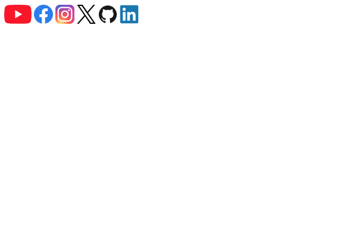

# Icon Support

When designing websites the social icon section is vital. But it is not easy to code.
But with SJML you can do with just a few lines of code.<br>
> Want to contribute and make SJML better? <br> See [Contribution](contributions.md) Page.


```html
<youtube><youtube>
```

### Preview


## Making it clickable

By default the icon doesn't do anything when it is clicked, because it is not customizable if it is linked to `https://www.youtube.com`

But you can make it clickable by doing this.

```html
<a href="https://www.youtube.com/@MrBeast/" target="_blank" rel="noopener noreferrer">
    <youtube></youtube>
</a>
```

## Other Icons

SJML is still in the development state, so it doesn't offer lots of features and icons. Here are the available icons.

```html
<instagram></instagram>
```

```html
<facebook></facebook>
```

```html
<twitter></twitter>
```

```html
<github></github>
```

```html
<linkedin></linkedin>
```

```html
<youtube></youtube>
```

### Preview



### Twitter

To get the old twitter logo use

```html
<twitterOG></twitterOG>
```

## All logos and tags

| Logo      | Tags                                                                                            |
| --------- | ----------------------------------------------------------------------------------------------- |
| Youtube   | <pre> \<youtube>\</youtube> </pre> <pre> \<yt>\</yt> </pre>                                     |
| Facebook  | <pre> \<facebook>\</facebook> </pre> <pre> \<fb>\</fb> </pre>                                   |
| Github    | <pre> \<github>\</github> </pre> <pre> \<git>\</git> </pre>                                     |
| Twitter   | <pre> \<twitter>\</twitter> </pre>                                                              |
| LinkedIn  | <pre> \<linkedin>\</linkedin> </pre>                                                            |
| Instagram | <pre> \<instagram>>\</instagram>> </pre> <pre> \<insta>\</insta> </pre><pre> \<ig>\</ig> </pre> |

<!-- > [!TIP] -->
> Want to contribute and make SJML better? <br> See [Contribution](contributions.md) Page.

## Customization

By default the size of most of our icons are `1em` x `1em`

Assign another local css or use `<style></style>` tags below the SJML css file for any customization.

### Example

```css
fb{
    height: 100px;
    width: 100px;
}
```

> [!WARNING]
> When resizing use both `height` and `width` properties and make sure they are the same
