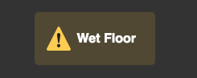

# Other Features

Some of the user-contributed or isolated features are listed below.

## Warnings

Use the following code to add warning signs to you web pages.

<warning>Wet Floor</warning>

> [!TIP]
> This feature works better with a dark colored background

### Preview

 

 