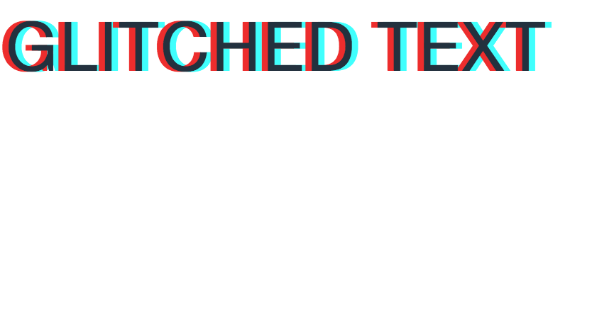
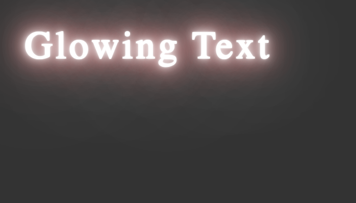

# Text Effects

Adding different effects to text has never been easier!

## Glitch Effect

Use the following line of code to add the glitched effect to your text.

```html
<glitch>Glitched Text</glitch>
```

### Preview



## Glowing Effect

Use the following line of code to add the glowing effect to your text.

```html
<glow>Glowing Text</glow>
```

> [!TIP]
> This feature works better with a dark colored background

### Preview



## Reflected Text

Use the following line of code to add the reflected effect to your text.

```html
<reflectBottom>Reflected Text</reflectBottom>
```
> [!CAUTION]
> This feature is in the development mode. Use at your own risk!<br>Browser Support is limited

<br>

[](other.md) [](animations.md)